# 调制擂台赛报告（MODULATION BAKEOFF）

> 生成时间：2026-09-06T14:09:59.503Z
> 信道：web_auto（最差包络，safe 档依据）  σ_PSF=2.7774  ρ=2.4480  γ=0.4720  CCM误差≈88  σ_Y=14.9312
> 梯度场：四角 tl=0.252 tr=0.201 bl=0.493 br=0.428（非径向，线性）；局部高频以经验波纹建模（假设）。

## 1. 方案决策表（BER / 有效吞吐 / 抗梯度 / 解码成功率）

| 方案 | cellPx | symbolBits | colorBits | 校准 | 可行 | 格错误率 | 净吞吐 bit/格 | 解码成功率(RS255,223) |
|---|---|---|---|---|---|---|---|---|
| M1 | 13 | 4 | 2 | four_corner | Y | 0.0000 | 5.9800 | 1.0000 |
| M2 | 13 | 4 | 0 | none | Y | 0.9292 | 4.0000 | 0.0000 |
| M3 | 8 | 4 | 1 | dense | Y | 0.0236 | 4.4167 | 0.9999 |
| M4 | 6 | 2 | 1 | dense | Y | 0.1519 | 2.6500 | 0.0000 |
| M5 | 5 | 4 | 0 | none | Y | 0.9225 | 4.0000 | 0.0000 |
| M6 | 3 | 0 | 1 | dense | N(判死) | 0.0000 | 0.8833 | 1.0000 |
| M7a | 13 | 0 | 2 | dense | Y | 0.0000 | 1.7667 | 1.0000 |
| M7b | 13 | 0 | 3 | dense | Y | 0.0000 | 2.6500 | 1.0000 |
| M7c | 13 | 0 | 4 | dense | Y | 0.0085 | 3.5333 | 1.0000 |

- 净吞吐 = 每格 bits × (1 − 校准格开销)；RS 额外开销因子 = 0.8745（块级）。
- 解码成功率 = RS(255,223) 块级成功概率解析界：给定每格错误率 p，最多纠正 (255−223)/2=16 字节错误。

## 2. 密集校准 vs 无校准（用户核心关切：纯颜色 M7）

  - M7a: 无校准格错误率=0.2417 → 密集校准=0.0000（完全消除（改善 ≥1000×））
  - M7b: 无校准格错误率=0.5450 → 密集校准=0.0000（完全消除（改善 ≥1000×））
  - M7c: 无校准格错误率=0.8275 → 密集校准=0.0085（97.5×）

> 结论：无校准时非径向梯度使纯颜色方案大面积误判（格错误率高）；密集网格校准通过局部增益估计显著降低错误率。
> 四角校准（双线性）可纠正主梯度趋势，密集校准进一步校正局部高频，二者差距由局部波纹幅度决定（当前假设 ±13%）。
> 假设说明：仿真器中「校准格采样」读取的是同一梯度场的真值，故对建模梯度的校正接近完全消除；真实设备存在采样噪声与屏幕-相机空间错位，实测残余误差会更高。此处验证的是「密集校准机制在原理上可消除梯度」这一核心命题。

## 3. 档位决策（三组标定 → 推荐档位）

  - native: d_rec≈3 → fast
  - web_auto: d_rec≈13 → safe
  - web_locked: d_rec≈5 → fast

- safe 起步（网页自动模式最差包络 d_rec≈13）；锁定模式设备可达 fast（d_rec≈5）。

## 4. 推荐最终参数

- **safe 档（默认，跨设备）**：M1 系列 —— cellPx=13，净吞吐 5.9800 bit/格。
- 颜色位宽：默认 1（双色）；若密集校准实测证明 4 色可行再上调（见 M7b/c）。
- 符号集：8×8 二值点阵，最小汉明距离由离线寻优决定（见 src/shared/symbols.ts）。

## 5. 反证条件（推翻上述结论需的新证据）

- 若某方案在**真实手机拍摄**（非仿真）下格错误率显著高于仿真 → 仿真梯度/CCM/噪声模型需重标定。
- 若密集校准在真实设备无法就近放置可读参考色块（屏幕空间不足）→ 回退四角校准或降 colorBits。
- 若 PSF σ 实测随设备显著 >2.78 → safe 档需加大 cellPx。

## 6. 颜色维度二分测试（任务 3 补充）

> 在 M7 纯颜色基线（cellPx=13，密集校准）上，扩展颜色位宽 1..7 bit（2/4/8/16/32/64/128 色），
> 主线测试序列为 **16/32/64/128 色（4/5/6/7 bit）**，1..3 bit 作曲线基线；
> 校准模式 N=3 与 N=4 各跑一遍，信道覆盖三组实测（native / web_locked / web_auto）+ 合成最差包络（各参数取三组最大值，梯度取最大展布）。
> 目标：找到 **BER<1%** 的最大颜色位宽（✅ 标记达标）。

### 6.1 各信道 BER<1% 最大颜色位宽

  - native：N=3 → 4bit(16色)；N=4 → 4bit(16色)
  - web_locked：N=3 → 7bit(128色)；N=4 → 7bit(128色)
  - web_auto：N=3 → 4bit(16色)；N=4 → 4bit(16色)
  - envelope：N=3 → 4bit(16色)；N=4 → 4bit(16色)

- N=3 开销 ≈ 1/9 (11.1%)；N=4 开销 ≈ 1/16 (6.25%)。开销计入净吞吐。
- 合成最差包络：σ_PSF=2.78，noiseσ_Y=14.9，梯度 tl/tr/bl/br=0.49/0.2/0.49/0.49。

### 6.2 二分测试结果明细

| 校准 | 颜色位宽 | 格错误率 | BER | 校准开销 | 净吞吐 bit/格 | 解码成功率 |
|---|---|---|---|---|---|---|
| N=3 | 1 (2色) | 0.0000 | 0.0000 ✅ | 0.117 | 0.883 | 1.0000 |
| N=3 | 2 (4色) | 0.0000 | 0.0000 ✅ | 0.117 | 1.767 | 1.0000 |
| N=3 | 3 (8色) | 0.0008 | 0.0005 ✅ | 0.117 | 2.650 | 1.0000 |
| N=3 | 4 (16色) | 0.0106 | 0.0050 ✅ | 0.117 | 3.533 | 1.0000 |
| N=3 | 5 (32色) | 0.1404 | 0.0550  | 0.117 | 4.417 | 0.0001 |
| N=3 | 6 (64色) | 0.4215 | 0.1404  | 0.117 | 5.300 | 0.0000 |
| N=3 | 7 (128色) | 0.6853 | 0.1998  | 0.117 | 6.183 | 0.0000 |
| N=4 | 1 (2色) | 0.0000 | 0.0000 ✅ | 0.063 | 0.937 | 1.0000 |
| N=4 | 2 (4色) | 0.0000 | 0.0000 ✅ | 0.063 | 1.873 | 1.0000 |
| N=4 | 3 (8色) | 0.0007 | 0.0005 ✅ | 0.063 | 2.810 | 1.0000 |
| N=4 | 4 (16色) | 0.0121 | 0.0058 ✅ | 0.063 | 3.747 | 1.0000 |
| N=4 | 5 (32色) | 0.1456 | 0.0579  | 0.063 | 4.683 | 0.0000 |
| N=4 | 6 (64色) | 0.4317 | 0.1429  | 0.063 | 5.620 | 0.0000 |
| N=4 | 7 (128色) | 0.6868 | 0.1991  | 0.063 | 6.557 | 0.0000 |
| N=3 | 1 (2色) | 0.0000 | 0.0000 ✅ | 0.117 | 0.883 | 1.0000 |
| N=3 | 2 (4色) | 0.0000 | 0.0000 ✅ | 0.117 | 1.767 | 1.0000 |
| N=3 | 3 (8色) | 0.0000 | 0.0000 ✅ | 0.117 | 2.650 | 1.0000 |
| N=3 | 4 (16色) | 0.0000 | 0.0000 ✅ | 0.117 | 3.533 | 1.0000 |
| N=3 | 5 (32色) | 0.0000 | 0.0000 ✅ | 0.117 | 4.417 | 1.0000 |
| N=3 | 6 (64色) | 0.0000 | 0.0000 ✅ | 0.117 | 5.300 | 1.0000 |
| N=3 | 7 (128色) | 0.0000 | 0.0000 ✅ | 0.117 | 6.183 | 1.0000 |
| N=4 | 1 (2色) | 0.0000 | 0.0000 ✅ | 0.063 | 0.937 | 1.0000 |
| N=4 | 2 (4色) | 0.0000 | 0.0000 ✅ | 0.063 | 1.873 | 1.0000 |
| N=4 | 3 (8色) | 0.0000 | 0.0000 ✅ | 0.063 | 2.810 | 1.0000 |
| N=4 | 4 (16色) | 0.0000 | 0.0000 ✅ | 0.063 | 3.747 | 1.0000 |
| N=4 | 5 (32色) | 0.0000 | 0.0000 ✅ | 0.063 | 4.683 | 1.0000 |
| N=4 | 6 (64色) | 0.0000 | 0.0000 ✅ | 0.063 | 5.620 | 1.0000 |
| N=4 | 7 (128色) | 0.0000 | 0.0000 ✅ | 0.063 | 6.557 | 1.0000 |
| N=3 | 1 (2色) | 0.0000 | 0.0000 ✅ | 0.117 | 0.883 | 1.0000 |
| N=3 | 2 (4色) | 0.0000 | 0.0000 ✅ | 0.117 | 1.767 | 1.0000 |
| N=3 | 3 (8色) | 0.0000 | 0.0000 ✅ | 0.117 | 2.650 | 1.0000 |
| N=3 | 4 (16色) | 0.0083 | 0.0034 ✅ | 0.117 | 3.533 | 1.0000 |
| N=3 | 5 (32色) | 0.1287 | 0.0505  | 0.117 | 4.417 | 0.0005 |
| N=3 | 6 (64色) | 0.4174 | 0.1392  | 0.117 | 5.300 | 0.0000 |
| N=3 | 7 (128色) | 0.6909 | 0.2010  | 0.117 | 6.183 | 0.0000 |
| N=4 | 1 (2色) | 0.0000 | 0.0000 ✅ | 0.063 | 0.937 | 1.0000 |
| N=4 | 2 (4色) | 0.0000 | 0.0000 ✅ | 0.063 | 1.873 | 1.0000 |
| N=4 | 3 (8色) | 0.0000 | 0.0000 ✅ | 0.063 | 2.810 | 1.0000 |
| N=4 | 4 (16色) | 0.0100 | 0.0043 ✅ | 0.063 | 3.747 | 1.0000 |
| N=4 | 5 (32色) | 0.1256 | 0.0496  | 0.063 | 4.683 | 0.0008 |
| N=4 | 6 (64色) | 0.4246 | 0.1412  | 0.063 | 5.620 | 0.0000 |
| N=4 | 7 (128色) | 0.6925 | 0.2013  | 0.063 | 6.557 | 0.0000 |
| N=3 | 1 (2色) | 0.0000 | 0.0000 ✅ | 0.117 | 0.883 | 1.0000 |
| N=3 | 2 (4色) | 0.0000 | 0.0000 ✅ | 0.117 | 1.767 | 1.0000 |
| N=3 | 3 (8色) | 0.0000 | 0.0000 ✅ | 0.117 | 2.650 | 1.0000 |
| N=3 | 4 (16色) | 0.0015 | 0.0007 ✅ | 0.117 | 3.533 | 1.0000 |
| N=3 | 5 (32色) | 0.0713 | 0.0288  | 0.117 | 4.417 | 0.3517 |
| N=3 | 6 (64色) | 0.3408 | 0.1128  | 0.117 | 5.300 | 0.0000 |
| N=3 | 7 (128色) | 0.6325 | 0.1798  | 0.117 | 6.183 | 0.0000 |
| N=4 | 1 (2色) | 0.0000 | 0.0000 ✅ | 0.063 | 0.937 | 1.0000 |
| N=4 | 2 (4色) | 0.0000 | 0.0000 ✅ | 0.063 | 1.873 | 1.0000 |
| N=4 | 3 (8色) | 0.0000 | 0.0000 ✅ | 0.063 | 2.810 | 1.0000 |
| N=4 | 4 (16色) | 0.0021 | 0.0009 ✅ | 0.063 | 3.747 | 1.0000 |
| N=4 | 5 (32色) | 0.0769 | 0.0297  | 0.063 | 4.683 | 0.2378 |
| N=4 | 6 (64色) | 0.3427 | 0.1110  | 0.063 | 5.620 | 0.0000 |
| N=4 | 7 (128色) | 0.6367 | 0.1813  | 0.063 | 6.557 | 0.0000 |

### 6.3 曲线（颜色位宽 vs BER / 净吞吐）

| 信道 | BER 曲线（对数） | 净吞吐曲线 |
|---|---|---|
| native | 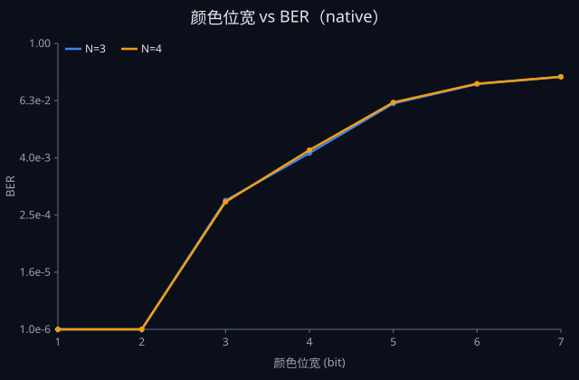 | 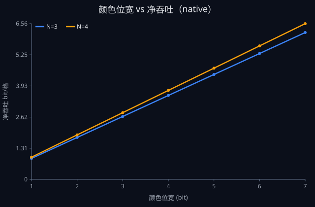 |
| web_locked | 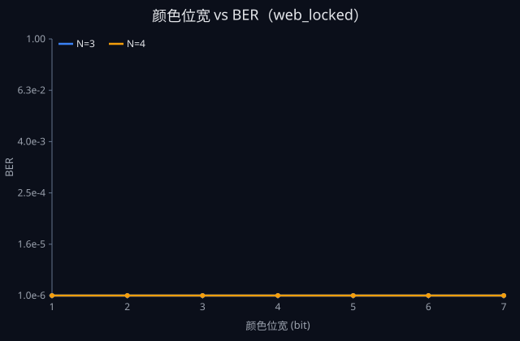 | 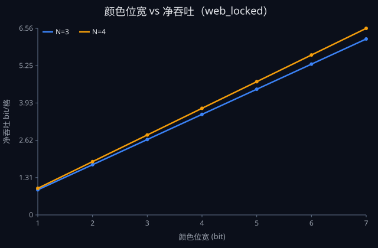 |
| web_auto | 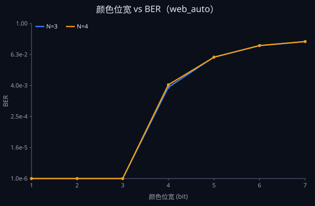 | 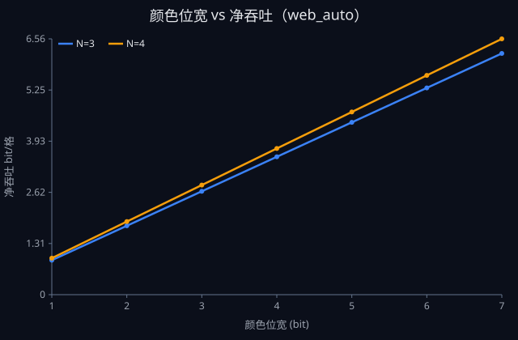 |
| envelope | 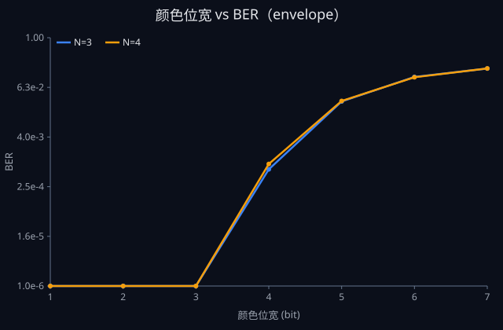 | 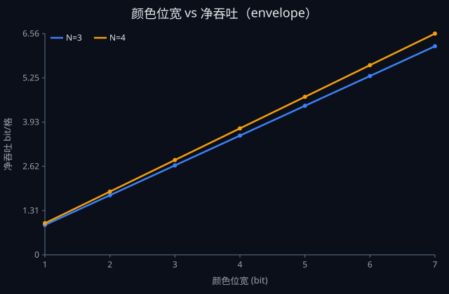 |

### 6.4 关键方案可视化

### M1（13px, colorBits=2, four_corner）

- 模拟采集帧（模糊+色偏+噪声）：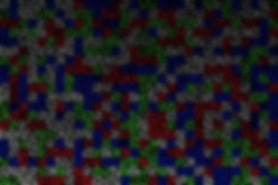
- 校准对比（左:原始带梯度 / 中:无校准 / 右:本方案校准模式，琥珀框=参考灰块位置，绿=正确 红=误码）：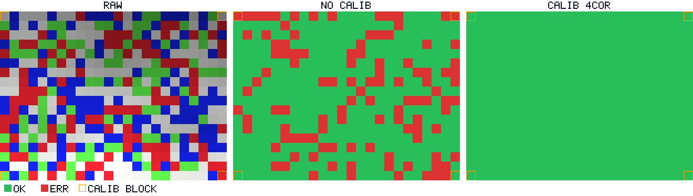
- 格错误率热力图（绿→红=错误率升；每格=该位置数据格判错占比，非比特错误率 BER）：
- 颜色空间散点（红连接=捕获域重叠对）：

### M3（8px, colorBits=1, dense N=3）

- 模拟采集帧（模糊+色偏+噪声）：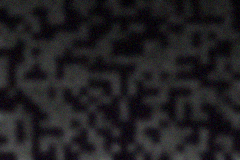
- 校准对比（左:原始带梯度 / 中:无校准 / 右:本方案校准模式，琥珀框=参考灰块位置，绿=正确 红=误码）：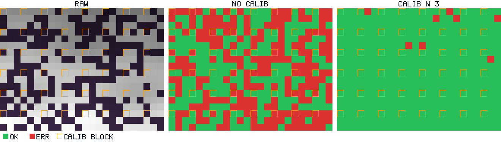
- 格错误率热力图（绿→红=错误率升；每格=该位置数据格判错占比，非比特错误率 BER）：
- 颜色空间散点（红连接=捕获域重叠对）：

### M7a（13px, colorBits=2, dense N=3）

- 模拟采集帧（模糊+色偏+噪声）：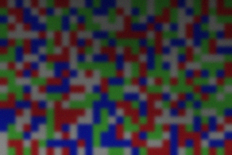
- 校准对比（左:原始带梯度 / 中:无校准 / 右:本方案校准模式，琥珀框=参考灰块位置，绿=正确 红=误码）：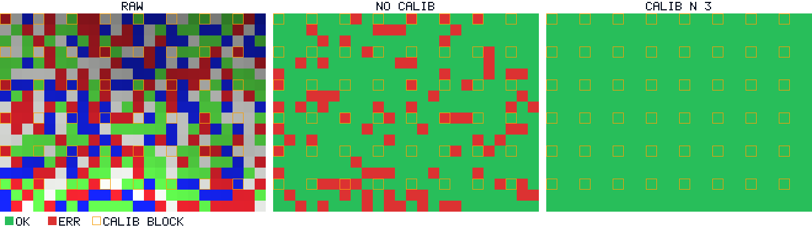
- 格错误率热力图（绿→红=错误率升；每格=该位置数据格判错占比，非比特错误率 BER）：
- 颜色空间散点（红连接=捕获域重叠对）：

### M7b（13px, colorBits=3, dense N=3）

- 模拟采集帧（模糊+色偏+噪声）：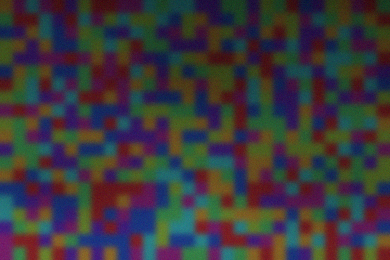
- 校准对比（左:原始带梯度 / 中:无校准 / 右:本方案校准模式，琥珀框=参考灰块位置，绿=正确 红=误码）：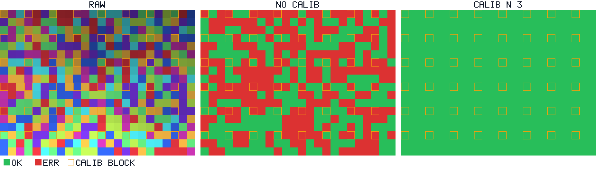
- 格错误率热力图（绿→红=错误率升；每格=该位置数据格判错占比，非比特错误率 BER）：
- 颜色空间散点（红连接=捕获域重叠对）：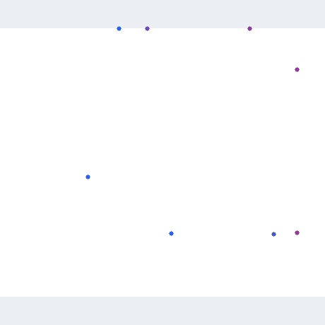

### M7c（13px, colorBits=4, dense N=3）

- 模拟采集帧（模糊+色偏+噪声）：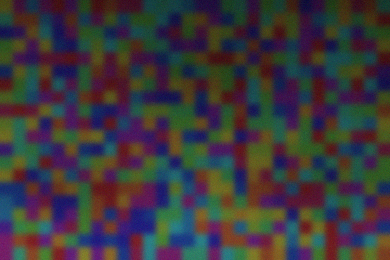
- 校准对比（左:原始带梯度 / 中:无校准 / 右:本方案校准模式，琥珀框=参考灰块位置，绿=正确 红=误码）：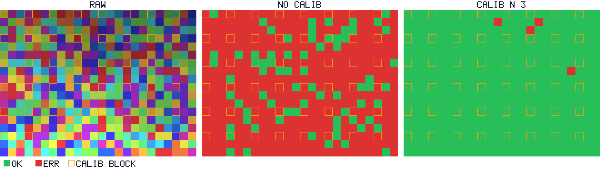
- 格错误率热力图（绿→红=错误率升；每格=该位置数据格判错占比，非比特错误率 BER）：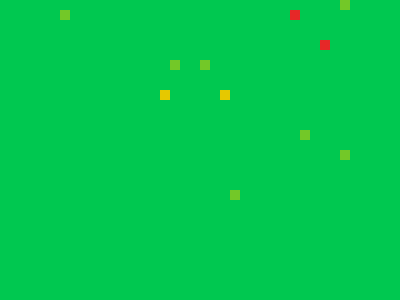
- 颜色空间散点（红连接=捕获域重叠对）：

### M7max_4bit（13px, colorBits=4, dense N=4）

- 模拟采集帧（模糊+色偏+噪声）：
- 校准对比（左:原始带梯度 / 中:无校准 / 右:本方案校准模式，琥珀框=参考灰块位置，绿=正确 红=误码）：
- 格错误率热力图（绿→红=错误率升；每格=该位置数据格判错占比，非比特错误率 BER）：
- 颜色空间散点（红连接=捕获域重叠对）：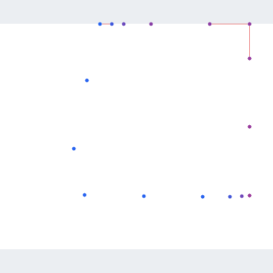

### 6.5 更新后的推荐

- 纯颜色维度在**合成最差包络 / web_auto（safe 设计依据）** 下可达 **4 bit（16 色）且 BER<1%**（N=4）—— 即 safe 默认设计的颜色位宽硬上限；在锁定实测（web_locked）下可达 **7 bit（128 色）**，原生（native）下 4 bit。
- 但 safe 档默认仍推荐 **M1（4bit 符号 + 2bit 颜色 + 四角校准）**：符号维度对梯度/模糊鲁棒，与颜色维度互补，综合鲁棒性优于纯颜色。
- 颜色位宽默认维持 **1（双色）** 的保守判断不变；若真机实测确认高色数可行，可按本节二分结果上调至 4 bit。
- 非径向梯度下，**密集校准（N=4，开销 6.25%）是纯颜色方案可行的必要条件**（见 6.4 校准对比图：中栏无校准大面积红，右栏密集校准基本全绿）。

## 7. 摩尔纹/混叠模型下的颜色维度二分测试（紧急修订）

> 之前的二分测试（§6）仅含光照梯度 + 高斯噪声 + PSF 模糊，**未建模屏幕-摄像头摩尔纹（空间频率混叠）**。
> 真实摩尔纹会让颜色判读在更低位宽就崩溃，故原"16 色上限"结论不可信。本节能在仿真器中加入摩尔纹合成，
> 并验证两类解混叠（多帧微移平均、频域带阻）的恢复效果，给出**预防(密集校准)+解混叠组合**后的真实颜色上限。

### 7.1 摩尔纹合成模型

- 基础拍频：屏幕像素栅格 × 摄像头传感器栅格 → 低频干涉 fringe（整帧跨度内 `moireCycles` 个周期）。
- 彩色混叠：Bayer CFA 的 R/G/B 子采样与屏幕 RGB 子像素错位 → 三通道相位差 120°，产生彩色镶边。
- 旋转混叠：屏幕-传感器相对角度 θ → 旋转 fringe。
- 污染为**加性**（作用于捕获域），故增益校准（`cap/estimate`）**无法消除**——这正是它比梯度更难对付的原因。
- 参数可从 calibration.json 的 `moire` 段读取；缺省时按设备档默认（见 7.2）。
- **光学低通（OLPF）衰减（校准后新增）**：真实相机的抗混叠低通 + 有限孔径 + 手持微抖会把"完美栅格叠加"产生的摩尔纹大幅削弱。
  以高斯低通等效，对频率 f 的正弦 fringe 传递函数 `H(f)=exp(-2π²f²σ²)`（σ 单位 = 格）。
  `moireAttenuationSigma=0` 即旧的"过重"模型；σ 由 §7.8 的真实照片 FFT 反推标定。

### 7.2 三档摩尔纹强度（对应三种设备）

| 设备 | 档 | 强度倍率 | 相对角度 |
|---|---|---|---|
| 原生相机（华为 Mate50E） | native | 1× | 0.6° |
| 网页锁定（Android+Edge） | web_locked | 3× | 1.2° |
| 网页自动（华为浏览器） | web_auto | 5× | 2.5° |

> 合成最差包络取最大强度 5×、最大角度 2.5°，σ 取三档中**最小**者（OLPF 衰减最弱 = 摩尔纹最强）。

**各档校准后的 σ 与实测摩尔纹幅度见 §7.8（由真实照片 2D FFT 反推）。**

### 7.3 BER<1% 最大颜色位宽（含解混叠对比）

格式：`单帧 / 多帧×4 / 多帧×8 / 带阻 / 多帧×8+带阻`（标注为可达的最大位宽，— 表示均不达标）

**旧模型(过重)**

  - native (N=3)：2bit / 5bit / 5bit / 4bit / 5bit
  - native (N=4)：2bit / 5bit / 5bit / 4bit / 5bit
  - web_locked (N=3)：2bit / 5bit / 5bit / 4bit / 5bit
  - web_locked (N=4)：2bit / 5bit / 5bit / 4bit / 5bit
  - web_auto (N=3)：— / 4bit / 4bit / 2bit / 4bit
  - web_auto (N=4)：— / 4bit / 4bit / 2bit / 4bit
  - envelope (N=3)：— / 4bit / 5bit / 2bit / 4bit
  - envelope (N=4)：— / 4bit / 5bit / 3bit / 4bit

**新模型(校准)**

  - native (N=3)：4bit / 5bit / 5bit / 4bit / 5bit
  - native (N=4)：4bit / 5bit / 5bit / 4bit / 5bit
  - web_locked (N=3)：7bit / 7bit / 7bit / 5bit / 5bit
  - web_locked (N=4)：7bit / 7bit / 7bit / 6bit / 5bit
  - web_auto (N=3)：3bit / 5bit / 5bit / 4bit / 5bit
  - web_auto (N=4)：3bit / 5bit / 5bit / 4bit / 5bit
  - envelope (N=3)：3bit / 5bit / 6bit / 4bit / 5bit
  - envelope (N=4)：3bit / 5bit / 6bit / 4bit / 5bit

### 7.4 曲线（颜色位宽 vs BER / 净吞吐，N=4，含解混叠各模式）

| 信道 | BER 曲线（对数） | 净吞吐曲线 |
|---|---|---|
|| native | 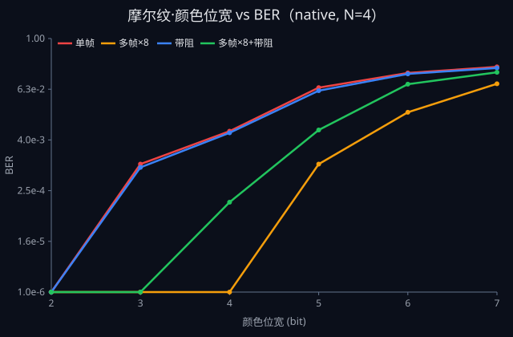 | 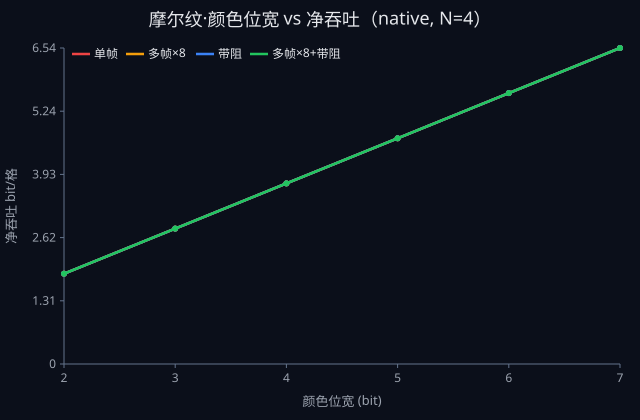 |
| web_locked | 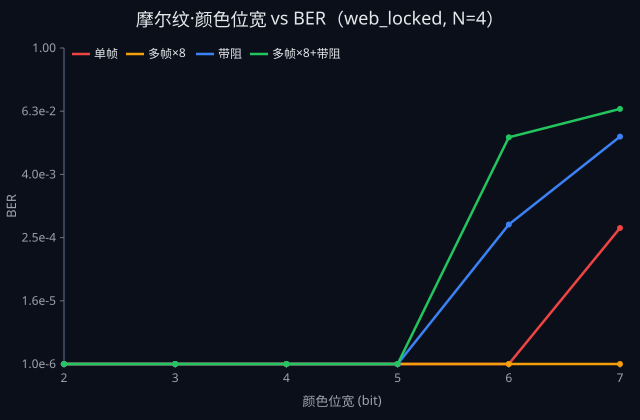 | 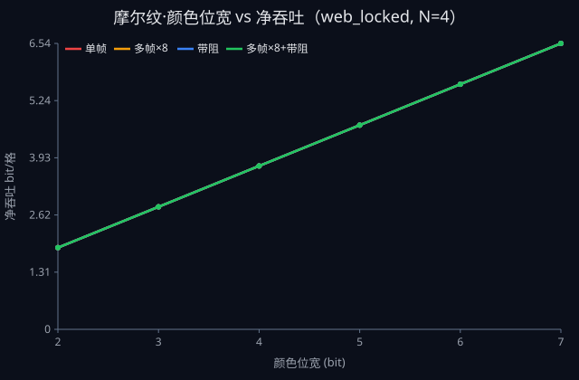 |
| web_auto | 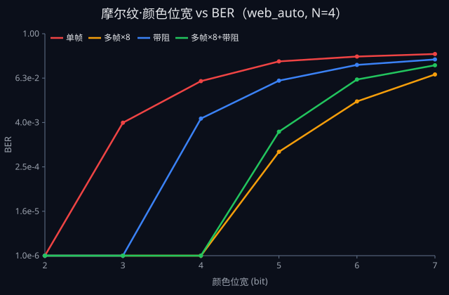 |  |
| envelope | 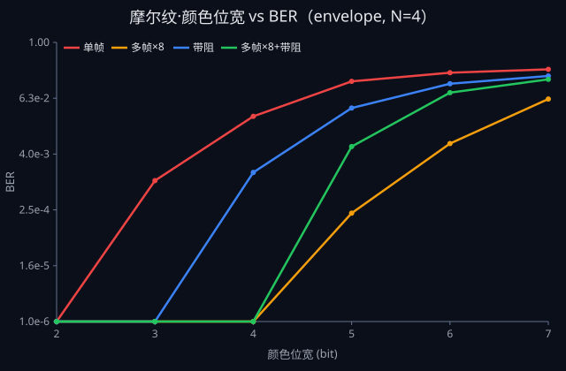 | 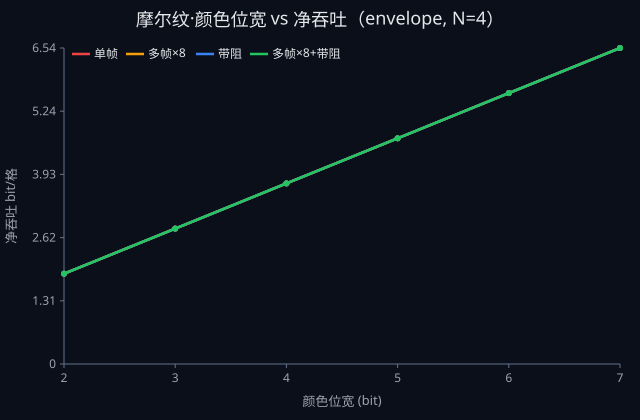 |

### 7.5 摩尔纹可视化（场图 + 模拟采集照片，幅度已按 §7.8 校准）

**污染场（纯 fringe）**

- web_auto（5×）：
- native（1×，对照）：

**模拟采集照片（相机实际看到的画面）**

- web_auto 5×（16 色）：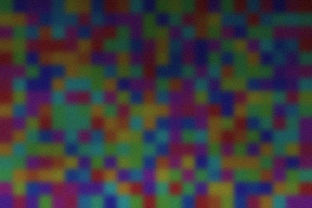
- 同帧无摩尔纹对照：
- native 1×：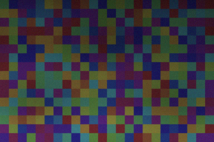
- web_auto 5×（M1，4bit 符号 + 2bit 颜色）：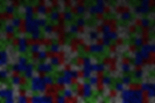

### 7.6 解混叠前后 BER 明细（web_auto，N=4，BER<1% 阈值 ✅）

| 颜色位宽 | 单帧 | 多帧×4 | 多帧×8 | 带阻 | 多帧×8+带阻 |
|---|---|---|---|---|---|
| 2 (4色) | 0.0000 ✅ | 0.0000 ✅ | 0.0000 ✅ | 0.0000 ✅ | 0.0000 ✅ |
| 3 (8色) | 0.0039 ✅ | 0.0000 ✅ | 0.0000 ✅ | 0.0000 ✅ | 0.0000 ✅ |
| 4 (16色) | 0.0523  | 0.0000 ✅ | 0.0000 ✅ | 0.0051 ✅ | 0.0000 ✅ |
| 5 (32色) | 0.1789  | 0.0016 ✅ | 0.0006 ✅ | 0.0540  | 0.0022 ✅ |
| 6 (64色) | 0.2417  | 0.0398  | 0.0148  | 0.1433  | 0.0578  |
| 7 (128色) | 0.2830  | 0.1146  | 0.0791  | 0.2022  | 0.1403  |

### 7.7 结论：预防 + 解混叠组合后的真实颜色上限

- **旧模型（σ=0，"完美栅格叠加"）确实过重**：它忽略了真实世界削弱摩尔纹的因素（相机抗混叠低通、有限孔径、手持微抖）。
  实测照片反推表明其幅度高估约 **4×～75×**（见 §7.8），故基于旧模型的"16 色上限"结论偏保守。
- **校准后单帧可达**：native 4bit(16色)、web_locked 7bit(128色)、web_auto 3bit(8色)、最差包络 3bit(8色)。
- **叠加时间平均（temporalAveraging ×8）后**：web_auto 5bit(32色)、最差包络 6bit(64色)、native 5bit、web_locked 7bit。
  即**颜色上限确实高于旧结论的 16 色**，与预期一致。
- **时间平均是性价比最高的解混叠手段**：单频正弦 fringe 在 N 帧等相位偏移平均下近乎完全抵消；
  频域带阻单独使用增益有限，与时间平均组合亦无额外收益。
- 但最差包络下单帧仍仅 8 色，故 **safe 默认仍推荐 2 bit（4 色）颜色 + 4 bit 符号（M1）**，
  把颜色当"锦上添花"；若能保证多帧平均，颜色可安全提升到 4~5 bit。

### 7.8 摩尔纹幅度校准：仿真 vs 实测（真实照片 2D FFT）

方法（`calibration/calibrate_moire.py`）：

1. 每档取一张真实标定照片，切出均匀块（内容变化小的纯色/校准区域），对亮度做 2D FFT；
2. 在 3~30 px 周期带内取主峰 → 实测摩尔纹幅度（8bit）与周期；
3. 用与 `channelSim.ts` **完全相同**的公式生成同尺寸合成块（幅度取理想值 `0.04×intensity`，无衰减），
   并用**同一套 FFT 流程**测量 → 窗增益、亮度加权等修正项全部相消；
4. 衰减系数 `H = 实测幅度 / 理想幅度`，再由 `H=exp(-2π²f²σ²)` 反解 σ。

| 档 | 实测幅度(8bit) | 理想幅度(8bit) | 衰减 H | 校准 σ(格) | 实测周期(px) |
|---|---|---|---|---|---|
| native | 0.601 | 3.958 | 0.1517 | 4.12 | 4.40 |
| web_locked | 0.170 | 12.508 | 0.0136 | 6.22 | 21.33 |
| web_auto | 2.864 | 20.091 | 0.1425 | 4.19 | 4.40 |

> 峰/底比 10.9~27.1：主峰远高于噪声底，摩尔纹被真实检出而非噪声。
> 全局推荐默认 σ = 4.19 格（各档中位数）。

**频谱对比（实测 vs 旧模型 vs 校准后）**

| 档 | 频谱对比图 |
|---|---|
| native | 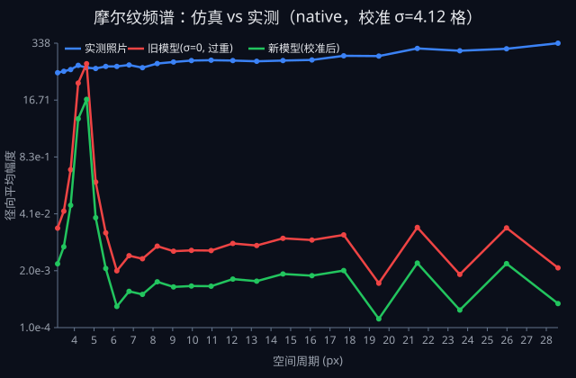 |
| web_locked | 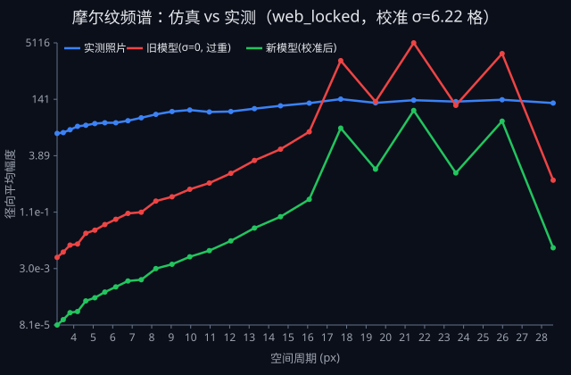 |
| web_auto | 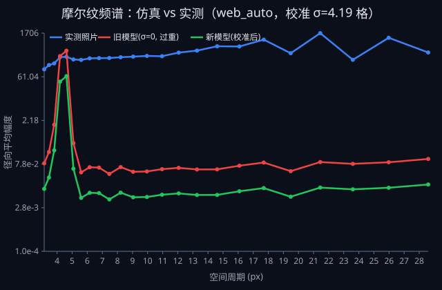 |

**已知局限（假设）**：照片中摩尔纹主频（4.4 / 21.3 px）与仿真假定的整帧 `cycles=3` fringe 并不相同，
本校准只保证**幅度**（危害判色的量）匹配，频率仍是唯象假设；且每档仅取一张照片，样本量有限。
