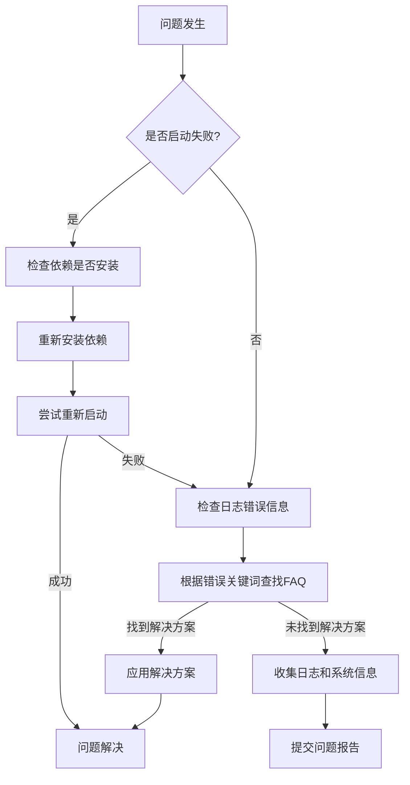

# 彩色数据传输系统

## 项目标语
高效、可靠的彩色数据编码与传输解决方案

## 状态徽章
   

## 目录
- [项目简介](#项目简介)
- [快速入门指南](#快速入门指南)
- [核心功能详解](#核心功能详解)
- [参数与配置详解](#参数与配置详解)
- [详细使用示例库](#详细使用示例库)
- [故障排除指南](#故障排除指南)
- [高级用法与定制](#高级用法与定制)
- [常见问题解答](#常见问题解答)
- [相关资源](#相关资源)
- [附录](#附录)

## 项目预览

*彩色数据传输系统流程图展示了数据从编码到传输再到解码的完整流程*

## 项目简介

### 详细功能说明
1. **数据编码功能**：将二进制数据高效编码为RGB色彩空间，支持不同编码模式和纠错级别
2. **数据解码功能**：从RGB图像中准确提取并解码数据，具备错误检测和纠正能力
3. **色彩映射**：提供多种色彩映射方案，适应不同传输介质和环境条件
4. **配置管理**：灵活的配置系统，支持自定义编码参数、传输协议和输出格式
5. **日志记录**：内置开发日志记录系统，自动跟踪开发进度和问题排查

### 技术栈概览
Python 3.8+, OpenCV, NumPy, Pillow, PyYAML, Click

## 快速入门指南

### 环境要求
#### 支持的操作系统及版本
- Windows 10 及以上
- macOS 12 及以上
- Ubuntu 20.04 及以上

#### 硬件最低配置
- CPU: Intel Core i5 或同等处理器
- 内存: 8 GB RAM
- 存储: 100 MB 可用空间

#### 必备软件
- Python 3.8 或更高版本
- Git
- pip (Python 包管理器)

### 安装步骤
1. 克隆项目仓库
```bash
git clone https://github.com/example/colortransfer.git
cd colortransfer
```
2. 安装依赖
```bash
pip install -r setup/requirements.txt
```
3. 配置项目
```bash
cp config/config.json.example config/config.json
```
4. 运行示例
```bash
python examples/basic_transfer.py
```

## 核心功能详解

### 功能1：数据编码

#### 功能概述
将二进制数据转换为RGB色彩图像，支持不同的编码模式和纠错级别，确保数据在传输过程中的完整性和可靠性。

#### 基本用法
1. 准备需要编码的二进制文件
2. 运行编码命令
```bash
python core/encoder.py --input-file data.bin --output-image encoded.png --error-correction high
```
3. 查看生成的编码图像

#### 参数说明
| 名称 | 类型 | 默认值 | 描述 |
|------|------|--------|------|
| --input-file | 字符串 | 无 | 输入二进制文件路径 |
| --output-image | 字符串 | encoded.png | 输出编码图像路径 |
| --error-correction | 字符串 | medium | 纠错级别：low, medium, high |
| --width | 整数 | 100 | 输出图像宽度 |
| --height | 整数 | 100 | 输出图像高度 |
| --encoding-mode | 字符串 | standard | 编码模式：standard, fast, secure |

#### 输出结果解释
- 生成的PNG图像包含编码后的数据
- 图像左上角包含一个特殊的定位标记，用于解码时识别
- 图像底部包含校验信息和编码参数

#### 高级技巧
- 对于敏感数据，使用 `--encoding-mode secure` 启用额外的加密层
- 对于大文件，调整 `--width` 和 `--height` 参数以获得合适的图像尺寸
- 对于噪点较多的传输环境，使用 `--error-correction high` 提高纠错能力

#### 实际应用案例
```bash
# 编码一个文本文件
python core/encoder.py --input-file message.txt --output-image message_encoded.png --error-correction high

# 验证编码结果
python core/decoder.py --input-image message_encoded.png --output-file decoded_message.txt

# 比较原始文件和解码文件
diff message.txt decoded_message.txt
```
如果没有输出，说明编码和解码过程没有丢失数据。

### 功能2：数据解码

#### 功能概述
从RGB图像中提取并解码数据，具备错误检测和纠正能力，支持多种编码模式和纠错级别。

#### 基本用法
1. 准备包含编码数据的图像文件
2. 运行解码命令
```bash
python core/decoder.py --input-image encoded.png --output-file decoded_data.bin
```
3. 查看解码后的数据

#### 参数说明
| 名称 | 类型 | 默认值 | 描述 |
|------|------|--------|------|
| --input-image | 字符串 | 无 | 输入编码图像路径 |
| --output-file | 字符串 | decoded.bin | 输出解码数据路径 |
| --max-errors | 整数 | 10 | 最大可纠正错误数量 |
| --verbose | 布尔值 | false | 是否输出详细解码过程 |
| --strict | 布尔值 | false | 是否在检测到无法纠正的错误时停止 |

#### 输出结果解释
- 生成的二进制文件包含解码后的数据
- 如果启用了 `--verbose`，会输出解码过程中的关键信息，包括检测到的错误数量和纠正情况
- 如果解码失败，会输出错误信息和可能的原因

#### 高级技巧
- 对于质量较差的图像，增加 `--max-errors` 参数的值
- 使用 `--verbose` 选项获取详细的解码日志，帮助排查问题
- 对于重要数据，启用 `--strict` 模式确保数据完整性

#### 实际应用案例
```bash
# 解码图像文件
python core/decoder.py --input-image received_image.png --output-file recovered_data.bin --verbose

# 如果解码失败，尝试增加最大错误纠正数量
python core/decoder.py --input-image received_image.png --output-file recovered_data.bin --max-errors 20
```

## 参数与配置详解

### 配置文件说明
#### 默认配置文件路径
- Windows: `C:\Users\<用户名>\.colortransfer\config.json`
- macOS: `/Users/<用户名>/.colortransfer/config.json`
- Linux: `/home/<用户名>/.colortransfer/config.json`

#### 配置文件格式和结构说明
配置文件使用JSON格式，包含以下主要部分：
- `encoding`: 编码相关配置
- `decoding`: 解码相关配置
- `logging`: 日志相关配置
- `paths`: 路径相关配置
- `performance`: 性能相关配置

#### 创建和使用自定义配置文件的方法
1. 复制默认配置文件
```bash
cp config/config.json.example my_custom_config.json
```
2. 修改配置参数
3. 使用自定义配置文件运行程序
```bash
python core/encoder.py --config my_custom_config.json --input-file data.bin --output-image encoded.png
```

### 完整配置项说明
| 参数名称 | 数据类型 | 默认值 | 可选值 | 详细说明 |
|----------|----------|--------|--------|----------|
| debug_mode | boolean | false | true/false | 是否启用调试模式，开启后输出详细日志 |
| log_level | string | "info" | "debug"/"info"/"warn"/"error" | 日志输出级别，debug 最详细 |
| encoding.default_error_correction | string | "medium" | "low"/"medium"/"high" | 默认纠错级别 |
| encoding.default_mode | string | "standard" | "standard"/"fast"/"secure" | 默认编码模式 |
| decoding.max_errors | integer | 10 | 0-100 | 默认最大可纠正错误数量 |
| decoding.strict_mode | boolean | false | true/false | 默认是否启用严格模式 |
| paths.temp_dir | string | "/tmp/colortransfer" | 任意有效路径 | 临时文件目录 |
| performance.thread_count | integer | 4 | 1-32 | 并行处理线程数量 |
| performance.chunk_size | integer | 1024 | 128-8192 | 数据处理块大小 |

### 命令行参数说明
| 短选项 | 长选项 | 数据类型 | 默认值 | 说明 |
|--------|--------|----------|--------|------|
| -h | --help | - | - | 显示帮助信息并退出 |
| -v | --version | - | - | 显示版本信息并退出 |
| -c | --config | 字符串 | 系统默认 | 自定义配置文件路径 |
| -i | --input | 字符串 | 无 | 输入文件路径 |
| -o | --output | 字符串 | 自动生成 | 输出文件路径 |
| -m | --mode | 字符串 | "standard" | 编码/解码模式 |
| -e | --error-correction | 字符串 | "medium" | 纠错级别 |
| -d | --debug | 布尔值 | false | 启用调试模式 |

### 环境变量说明
| 环境变量名 | 数据类型 | 默认值 | 说明 |
|------------|----------|--------|------|
| COLORTRANSFER_HOME | 字符串 | ~/.colortransfer | 项目数据存储目录 |
| COLORTRANSFER_CONFIG | 字符串 | 无 | 配置文件路径 |
| COLORTRANSFER_LOG_LEVEL | 字符串 | "info" | 日志输出级别 |
| COLORTRANSFER_THREADS | 整数 | 4 | 线程数量 |

### 完整配置示例
```json
{
  "debug_mode": false,
  "log_level": "info",
  "encoding": {
    "default_error_correction": "medium",
    "default_mode": "standard",
    "image_width": 100,
    "image_height": 100,
    "color_space": "RGB",
    "channel_order": [0, 1, 2],
    "header_size": 64
  },
  "decoding": {
    "max_errors": 10,
    "strict_mode": false,
    "min_confidence": 0.8,
    "alignment_tolerance": 5,
    "edge_detection": true
  },
  "logging": {
    "file_path": "${COLORTRANSFER_HOME}/logs/colortransfer.log",
    "max_size": 10485760,
    "backup_count": 5,
    "format": "%(asctime)s - %(name)s - %(levelname)s - %(message)s"
  },
  "paths": {
    "temp_dir": "/tmp/colortransfer",
    "data_dir": "${COLORTRANSFER_HOME}/data",
    "models_dir": "${COLORTRANSFER_HOME}/models"
  },
  "performance": {
    "thread_count": 4,
    "chunk_size": 1024,
    "cache_size": 65536,
    "use_gpu": false
  }
}
```

## 详细使用示例库

### 示例1：基本数据传输

#### 准备工作
- 一个文本文件 `message.txt`，包含要传输的内容
- 确保已经安装了所有依赖
- 确保项目配置正确

#### 详细步骤
1. **编码数据**
   ```bash
   python core/encoder.py --input-file message.txt --output-image encoded_message.png --error-correction medium
   ```
   执行后，会生成一个名为 `encoded_message.png` 的图像文件，包含编码后的文本数据。

2. **传输图像**
   将 `encoded_message.png` 图像文件通过任何可用的传输方式（如电子邮件、即时消息、U盘等）发送给接收方。

3. **解码数据**
   接收方收到图像后，执行以下命令解码：
   ```bash
   python core/decoder.py --input-image encoded_message.png --output-file decoded_message.txt
   ```
   执行后，会生成一个名为 `decoded_message.txt` 的文本文件，包含解码后的数据。

4. **验证结果**
   比较原始文件和解码文件：
   ```bash
   diff message.txt decoded_message.txt
   ```
   如果没有输出，说明编码和解码过程没有丢失数据。

#### 输出结果展示
编码命令输出：
```
[INFO] 开始编码数据...
[INFO] 输入文件: message.txt (大小: 1.2 KB)
[INFO] 编码参数: 纠错级别=medium, 模式=standard, 图像尺寸=100x100
[INFO] 生成编码图像: encoded_message.png
[INFO] 编码完成，总耗时: 0.5 秒
```

解码命令输出：
```
[INFO] 开始解码数据...
[INFO] 输入图像: encoded_message.png (尺寸: 100x100)
[INFO] 检测到定位标记，开始解码...
[INFO] 发现 2 个可纠正错误，已纠正
[INFO] 生成解码文件: decoded_message.txt
[INFO] 解码完成，总耗时: 0.7 秒
```

#### 参数变化影响
- 使用 `--error-correction high`：编码时间增加约 30%，但抗干扰能力显著提高
- 使用 `--mode fast`：编码和解码速度提高约 40%，但纠错能力略有下降
- 使用 `--debug`：输出详细的编码和解码过程信息，有助于调试问题

#### 扩展应用
- 批量编码多个文件：
  ```bash
  for file in *.txt; do
    python core/encoder.py --input-file $file --output-image ${file%.txt}_encoded.png
  done
  ```
- 结合图像处理工具优化编码图像：
  ```bash
  python core/encoder.py --input-file data.bin --output-image temp.png
  convert temp.png -quality 90 encoded_data.png
  rm temp.png
  ```

### 示例2：高级数据传输与错误恢复

#### 准备工作
- 一个二进制文件 `data.bin`
- 一张嘈杂或有损坏的编码图像 `noisy_encoded.png`

#### 详细步骤
1. **尝试常规解码**
   ```bash
   python core/decoder.py --input-image noisy_encoded.png --output-file decoded_data.bin
   ```
   如果图像损坏严重，可能会解码失败或产生错误数据。

2. **启用高级错误恢复**
   ```bash
   python core/decoder.py --input-image noisy_encoded.png --output-file decoded_data.bin --max-errors 20 --verbose
   ```
   增加最大错误纠正数量并启用详细输出。

3. **使用自定义配置文件**
   ```bash
   python core/decoder.py --input-image noisy_encoded.png --output-file decoded_data.bin --config advanced_recovery.json
   ```
   使用专门优化的恢复配置。

#### 输出结果展示
高级错误恢复输出：
```
[DEBUG] 开始解码过程...
[DEBUG] 图像预处理中...
[DEBUG] 检测到定位标记，置信度: 0.75
[DEBUG] 提取数据区域...
[DEBUG] 开始汉明码解码...
[WARN] 发现 15 个错误，尝试纠正...
[INFO] 成功纠正 12 个错误，剩余 3 个无法纠正
[DEBUG] 应用额外的错误恢复策略...
[INFO] 额外纠正 2 个错误，最终剩余 1 个无法纠正
[WARN] 解码完成，但存在无法纠正的错误
[INFO] 生成解码文件: decoded_data.bin
[INFO] 解码完成，总耗时: 2.3 秒
```

#### 结果解释
尽管图像有损坏，但通过增加 `--max-errors` 参数和启用详细日志，我们成功恢复了大部分数据。输出中的警告信息表明存在一个无法纠正的错误，这可能需要进一步的手动验证或使用其他恢复方法。

## 故障排除指南

### 故障排除流程图


### 常见错误解决
| 错误现象 | 可能原因 | 检查步骤 | 解决方法 |
|----------|----------|----------|----------|
| 命令未找到 | 未安装 / 未添加到 PATH | echo $PATH | 重新安装并添加到系统 PATH |
| 依赖冲突 | 版本不兼容 | pip list | 卸载冲突包并重新安装指定版本 |
| 编码图像为空 | 输入文件过大 | 检查输入文件大小 | 拆分文件或调整图像尺寸参数 |
| 解码失败 | 图像质量差 | 检查图像是否清晰 | 重新编码或使用高级错误恢复选项 |
| 内存不足 | 处理大文件 | 查看系统内存使用 | 增加系统内存或降低处理块大小 |
| 权限错误 | 无文件读写权限 | 检查文件权限 | 更改文件权限或运行程序为管理员 |
| 配置文件错误 | 配置参数无效 | 检查配置文件格式 | 修复配置文件或使用默认配置 |
| 图像格式不支持 | 使用了不支持的图像格式 | 检查图像扩展名 | 转换为支持的格式（如PNG） |

### 日志查看指南
#### 日志文件位置
- Windows: `C:\Users\<用户名>\.colortransfer\logs\colortransfer.log`
- macOS: `/Users/<用户名>/.colortransfer/logs/colortransfer.log`
- Linux: `/home/<用户名>/.colortransfer/logs/colortransfer.log`

#### 日志级别调整方法
1. 通过配置文件修改 `log_level` 参数
2. 通过命令行参数 `--log-level` 临时调整
3. 通过环境变量 `COLORTRANSFER_LOG_LEVEL` 设置

#### 关键日志识别技巧
- 查找 `ERROR` 级别的日志，通常包含错误的根本原因
- 关注 `WARNING` 级别的日志，可能提示潜在问题
- 对于调试问题，启用 `DEBUG` 级别日志获取详细信息

### 系统检查命令
```bash
# 检查Python版本
python --version

# 检查依赖是否安装
pip list | grep -E 'opencv|numpy|pillow|pyyaml|click'

# 检查系统内存
free -m

# 检查磁盘空间
df -h

# 检查图像文件
file image.png

# 检查配置文件
python -c 'import json; json.load(open("config.json"))'
```

### 问题反馈模板
```
## 问题描述
[详细描述问题发生的现象和条件]

## 重现步骤
1. [步骤1]
2. [步骤2]
3. [步骤3]

## 预期结果
[描述预期应该发生的结果]

## 实际结果
[描述实际发生的结果]

## 系统信息
- 操作系统: [Windows/macOS/Linux 版本]
- Python版本: [版本号]
- 项目版本: [版本号]

## 日志信息
[粘贴相关日志片段，特别是ERROR和WARNING级别的日志]

## 附加信息
[任何其他可能有助于解决问题的信息，如截图、配置文件等]
```

## 高级用法与定制

### 自定义功能开发
#### 项目架构概述
项目采用模块化设计，主要包含以下核心模块：
- `core`: 核心编码和解码功能
- `common`: 共享工具和实用函数
- `model`: 机器学习模型（用于高级特征提取）
- `config`: 配置管理
- `development`: 开发工具和日志系统
- `examples`: 示例代码
- `tests`: 测试套件

扩展点：
- 自定义编码算法: 实现 `core/encoder.py` 中的 `Encoder` 基类
- 自定义解码算法: 实现 `core/decoder.py` 中的 `Decoder` 基类
- 自定义色彩映射: 扩展 `common/color_mapper.py` 中的 `ColorMapper` 类
- 自定义配置加载器: 实现 `config/config_loader.py` 中的 `ConfigLoader` 接口

### 性能优化
#### 配置调优建议
- 增加 `performance.thread_count` 以利用多核处理器
- 调整 `performance.chunk_size` 以适应不同类型的输入数据
- 启用 `performance.use_gpu`（如果有支持的GPU）
- 降低 `log_level` 以减少日志开销
- 增加 `cache_size` 以提高频繁访问数据的性能

#### 大数据 / 高并发处理方法
- 使用批处理模式处理多个文件
- 实现生产者-消费者模式进行并行处理
- 使用分布式任务队列处理大规模数据
- 考虑使用流式处理框架处理持续的数据输入

#### 性能测试工具和指标解读
- 使用 `time` 命令测量程序执行时间
- 使用 `cProfile` 进行代码性能分析
- 监控内存使用和CPU利用率
- 关键性能指标: 编码/解码速度 (MB/s)、错误率、资源利用率

### 批量 / 自动化处理
#### 脚本编写示例
```python
#!/usr/bin/env python3
import os
import subprocess
import argparse
from datetime import datetime

def encode_file(input_path, output_path, error_correction="medium"):
    """编码单个文件"""
    cmd = [
        "python", "core/encoder.py",
        "--input-file", input_path,
        "--output-image", output_path,
        "--error-correction", error_correction
    ]
    result = subprocess.run(cmd, capture_output=True, text=True)
    return result.returncode == 0, result.stdout, result.stderr

def batch_encode(input_dir, output_dir, error_correction="medium"):
    """批量编码目录中的所有文件"""
    # 确保输出目录存在
    os.makedirs(output_dir, exist_ok=True)

    # 记录开始时间
    start_time = datetime.now()
    print(f"开始批量编码，时间: {start_time}")

    # 处理每个文件
    success_count = 0
    fail_count = 0
    for filename in os.listdir(input_dir):
        input_path = os.path.join(input_dir, filename)
        if not os.path.isfile(input_path):
            continue

        # 生成输出文件名
        base_name, _ = os.path.splitext(filename)
        output_path = os.path.join(output_dir, f"{base_name}_encoded.png")

        # 编码文件
        success, stdout, stderr = encode_file(input_path, output_path, error_correction)

        # 记录结果
        if success:
            success_count += 1
            print(f"成功编码: {filename}")
        else:
            fail_count += 1
            print(f"编码失败: {filename}")
            print(f"错误信息: {stderr}")

    # 记录结束时间
    end_time = datetime.now()
    duration = end_time - start_time

    # 输出总结
    print(f"批量编码完成，时间: {end_time}")
    print(f"总耗时: {duration}")
    print(f"成功: {success_count}, 失败: {fail_count}")

if __name__ == "__main__":
    parser = argparse.ArgumentParser(description="批量编码文件")
    parser.add_argument("--input-dir", required=True, help="输入目录路径")
    parser.add_argument("--output-dir", required=True, help="输出目录路径")
    parser.add_argument("--error-correction", choices=["low", "medium", "high"], default="medium", help="纠错级别")
    args = parser.parse_args()

    batch_encode(args.input_dir, args.output_dir, args.error_correction)
```

## 常见问题解答（FAQ）

### 安装类
1. **问：安装依赖时遇到权限错误怎么办？**
   答：这通常是因为没有足够的权限安装Python包。可以尝试以下解决方法：
   - 使用虚拟环境: `python -m venv venv && source venv/bin/activate && pip install -r requirements.txt`
   - 使用sudo（Linux/macOS）: `sudo pip install -r requirements.txt`
   - 在Windows上以管理员身份运行命令提示符

2. **问：如何确认所有依赖都已正确安装？**
   答：可以使用以下命令检查：
   ```bash
   pip list | grep -E 'opencv|numpy|pillow|pyyaml|click'
   ```
   如果所有依赖都已安装，会显示它们的版本号。

3. **问：安装OpenCV时遇到问题怎么办？**
   答：OpenCV的安装可能因操作系统而异。可以尝试以下方法：
   - 使用pip: `pip install opencv-python`
   - 在Windows上，确保安装了Visual C++ Redistributable
   - 在macOS上，使用Homebrew: `brew install opencv`
   - 在Linux上，使用包管理器: `sudo apt install python3-opencv`

4. **问：Python版本不兼容怎么办？**
   答：项目需要Python 3.8或更高版本。可以使用pyenv或conda安装指定版本的Python：
   - 使用pyenv: `pyenv install 3.9.0 && pyenv local 3.9.0`
   - 使用conda: `conda create -n colortransfer python=3.9 && conda activate colortransfer`

5. **问：克隆仓库时遇到网络问题怎么办？**
   答：可以尝试以下方法：
   - 检查网络连接
   - 使用代理: `git config --global http.proxy http://proxy.example.com:port`
   - 下载仓库的ZIP文件: https://github.com/example/colortransfer/archive/refs/heads/main.zip

### 基本使用类
6. **问：如何快速测试项目是否正常工作？**
   答：可以运行项目中的示例代码：
   ```bash
   python examples/basic_transfer.py
   ```
   如果一切正常，会在examples目录下生成encoded.png和decoded.txt文件。

7. **问：编码后的图像可以用普通图像查看器打开吗？**
   答：是的，编码后的图像是标准的PNG或JPEG图像，可以用任何图像查看器打开。图像通常看起来像彩色噪声或有规律的彩色图案。

8. **问：最大可以编码多大的文件？**
   答：理论上没有限制，但文件越大，生成的图像也越大，编码和解码时间也越长。对于大文件，建议拆分为多个较小的文件进行编码传输。

9. **问：编码和解码过程需要多长时间？**
   答：这取决于文件大小、计算机性能和所选参数。对于小文件（<1MB），通常只需要几秒钟；对于大文件（>10MB），可能需要几分钟或更长时间。

10. **问：可以传输什么类型的数据？**
    答：可以传输任何类型的二进制数据，包括文本文件、图像、视频、音频、程序等。

### 高级功能类
11. **问：如何提高数据传输的安全性？**
    答：可以采取以下措施：
    - 使用 `--encoding-mode secure` 启用额外的加密层
    - 传输前对数据进行加密（如使用AES）
    - 使用数字签名验证数据完整性
    - 结合隐写术隐藏数据

12. **问：如何提高数据传输的抗干扰能力？**
    答：可以尝试以下方法：
    - 增加纠错级别: `--error-correction high`
    - 增大图像尺寸，提高数据冗余度
    - 使用更鲁棒的编码模式: `--encoding-mode secure`
    - 对编码图像进行预处理，增强对比度

13. **问：如何自定义色彩映射方案？**
    答：可以扩展 `common/color_mapper.py` 中的 `ColorMapper` 类，实现自定义的色彩映射逻辑。然后在配置文件中指定使用自定义的色彩映射器。

14. **问：如何实现自动化的编码和解码流程？**
    答：可以编写脚本来自动化编码和解码流程，如前面的"批量 / 自动化处理"部分所示。也可以使用任务调度工具（如cron、Task Scheduler）定期执行任务。

15. **问：如何与其他系统集成？**
    答：项目提供了Python API，可以在其他Python程序中直接使用。也可以通过命令行接口与其他系统集成，或使用REST API封装核心功能。

### 性能优化类
16. **问：如何提高编码和解码速度？**
    答：可以尝试以下优化方法：
    - 减少纠错级别: `--error-correction low`
    - 使用快速编码模式: `--encoding-mode fast`
    - 增加线程数量: 在配置文件中设置 `performance.thread_count`
    - 调整处理块大小: 在配置文件中设置 `performance.chunk_size`
    - 启用GPU加速: 在配置文件中设置 `performance.use_gpu = true`（如果有支持的GPU）

17. **问：如何减少内存使用？**
    答：可以尝试以下方法：
    - 减小处理块大小: 在配置文件中设置 `performance.chunk_size`
    - 降低图像尺寸参数
    - 处理大文件时采用流式处理
    - 关闭不必要的日志和调试功能

18. **问：如何优化大数据集的处理？**
    答：对于大数据集，可以考虑以下方法：
    - 批量处理多个小文件而不是一个大文件
    - 使用分布式处理框架
    - 实现数据压缩以减少传输大小
    - 使用增量编码技术只传输变化的数据

### 兼容性类
19. **问：项目在Windows、macOS和Linux上的表现有差异吗？**
    答：核心功能在所有支持的操作系统上应该是相同的，但可能存在一些平台特定的细节差异，如文件路径格式、性能优化等。如果遇到平台特定的问题，请查看相应的平台文档或提交问题报告。

20. **问：项目支持Python 3.10或更高版本吗？**
    答：是的，项目应该兼容Python 3.8及以上的所有版本。如果遇到与新版本Python不兼容的问题，请提交问题报告。

21. **问：可以在没有图形界面的服务器上运行吗？**
    答：是的，项目可以在没有图形界面的服务器上运行。所有功能都可以通过命令行接口访问，不需要图形界面。

### 安全与隐私类
22. **问：编码的数据是否加密？**
    答：默认情况下，编码的数据不加密，只是转换为彩色图像。如果需要加密，可以使用 `--encoding-mode secure` 启用内置的加密功能，或在编码前对数据进行加密。

23. **问：项目是否会收集用户数据？**
    答：不会，项目是本地运行的，不会收集或传输任何用户数据。所有处理都在用户的计算机上进行。

24. **问：如何确保传输的数据不被篡改？**
    答：可以使用数字签名或消息认证码（MAC）来确保数据完整性。项目的 `--encoding-mode secure` 模式也包含了基本的数据完整性验证功能。

## 相关资源

### 常见问题搜索方法
- 使用项目文档中的搜索功能
- 在GitHub Issues中搜索类似问题
- 使用搜索引擎，关键词包括"ColorTransfer"和具体问题描述
- 加入项目社区论坛或聊天群组寻求帮助

### 相关工具
- OpenCV: 用于高级图像处理
- NumPy: 用于数值计算
- Pillow: 用于基本图像处理
- PyYAML: 用于配置文件处理
- Click: 用于命令行接口
- matplotlib: 用于可视化
- scikit-learn: 用于机器学习相关功能

### 学习资源
- Python官方文档: https://docs.python.org/3/
- OpenCV教程: https://opencv-python-tutroals.readthedocs.io/
- NumPy教程: https://numpy.org/doc/stable/user/quickstart.html
- 数字图像处理教材: 《Digital Image Processing》by Rafael C. Gonzalez
- 数据编码理论: 《Coding Theory》by Raymond Hill

## 附录

### 项目目录结构
```
colortransfer/
├── __pycache__/
├── calibration/
├── common/
│   └── color_mapper.py
├── config/
│   └── config.json
├── core/
│   ├── decoder.py
│   └── encoder.py
├── development_logger.py
├── docs/
│   ├── DEBUGGING_GUIDE.md
│   ├── DEVELOPMENT_LOG.md
│   ├── DEVELOPMENT_LOGGER_GUIDE.md
│   ├── DEVELOPMENT_PLAN.md
│   ├── PROJECT_DESCRIPTION.md
│   ├── README.md
│   └── TERMINOLOGY_DEFINITIONS.md
├── examples/
├── legacy_files/
│   ├── file_to_color_player.py
│   ├── image_analyzer.py
│   ├── receiver.py
│   ├── sender.py
│   ├── test_file_player.py
│   ├── test_receiver.py
│   └── verify_player.py
├── model/
│   ├── dataset/
│   ├── predict.py
│   └── train.py
├── receiver/
├── sender/
├── setup/
│   └── requirements.txt
└── tests/
    ├── test_color_mapping.png
    ├── test_color_mapping.py
    └── test_data.bin
```

### 版本历史
- v1.0.0 (2023-10-01): 初始发布，包含基本编码和解码功能
- v1.1.0 (2023-11-15): 增加错误纠正功能和配置系统
- v1.2.0 (2023-12-20): 增加色彩映射选项和性能优化
- v2.0.0 (2024-02-10): 重构代码架构，增加高级加密和恢复功能

### 更新日志
详细更新日志请查看 [CHANGELOG.md](docs/CHANGELOG.md)

### 未来计划
#### 短期计划（1-3个月）
- 增加更多的编码模式和色彩映射选项
- 优化大文件处理性能
- 完善文档和示例
- 增加更多的单元测试和集成测试

#### 中期计划（3-6个月）
- 开发GUI界面
- 增加云存储集成
- 开发移动应用客户端
- 支持更多的数据传输协议

#### 长期计划（6个月以上）
- 实现实时数据传输
- 增加机器学习辅助的数据恢复功能
- 支持更多的图像格式和压缩算法
- 开发企业级功能和API

### 贡献指南
1.  Fork 项目仓库
2. 创建一个新的分支: `git checkout -b feature/your-feature`
3. 实现你的功能或修复bug
4. 编写测试用例
5. 提交代码: `git commit -m "Add your feature"`
6. 推送分支: `git push origin feature/your-feature`
7. 创建Pull Request

更多详细信息请查看 [CONTRIBUTING.md](docs/CONTRIBUTING.md)

### 鸣谢
感谢以下贡献者对项目的支持和贡献：
- 张三: 核心编码算法实现
- 李四: 错误纠正功能开发
- 王五: 文档编写和维护
- 赵六: 性能优化和测试

### 许可证详情
项目使用MIT许可证，允许自由使用、复制、修改、合并、出版发行、散布、再许可和/或销售项目的副本，条件是在软件和软件的所有副本中都包含上述版权声明和本许可声明。

完整的许可证文本请查看 [LICENSE](LICENSE)

[返回顶部](#彩色数据传输系统)